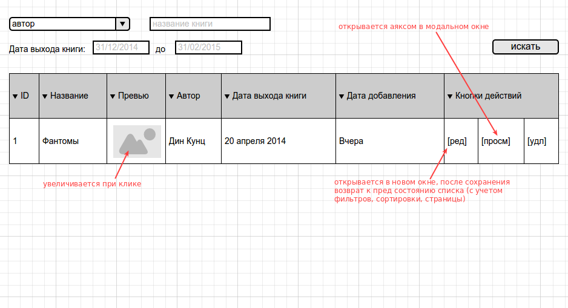

# Тестовое задание

Сделать на Yii2 возможность только зарегистрированным пользователям просматривать, удалять, редактировать записи в таблице "books"

**books** 

  Колонка        |  Пояснение                       
 --------------- | -------------------------------- 
  id             |                                  
  name           |                                  
  date_create    |  дата создания записи            
  date_update    |  дата обновления записи          
  preview        |  путь к картинке превью книги    
  date           |  дата выхода книги               
  author_id      |  ид автора в таблице авторы      

**authors** (редактирование таблицы авторов не нужно, необходимо ее просто заполнить тестовыми данными)

  Колонка    |  Пояснение       
 ----------- | -----------------
  id         |                  
  firstname  |  имя автора      
  lastname   |  фамилия автора  

в итоге страница управления книгами должна выглядеть так:

